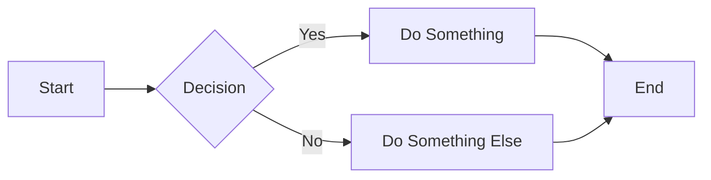

# MkDocs Project Template for CLI Tool Documentation

A complete, production-ready MkDocs template for documenting command-line interface (CLI) tools. This template includes modern design, automatic GitHub Pages deployment, and comprehensive documentation examples.

## Features

- 📚 **Complete Documentation Structure**: Pre-built pages for getting started, command reference, and FAQ
- 🎨 **Material Theme**: Modern, responsive design with dark mode support
- 🚀 **GitHub Actions CI/CD**: Automatic deployment to GitHub Pages
- 🔍 **Full-Text Search**: Built-in search functionality
- 📊 **Mermaid Diagrams**: Support for flowcharts and diagrams
- 📱 **Mobile Responsive**: Looks great on all devices
- ♿ **Accessible**: WCAG compliant design
- 🌐 **Versioning Ready**: Easy to add version management
- 💬 **Interactive Examples**: Code blocks with syntax highlighting

## Quick Start

### Prerequisites

- Python 3.8 or higher
- pip (Python package manager)
- Git

### Installation

1. **Clone or download this template:**

   ```bash
   git clone <repository-url>
   cd MkDocsTemplate
   ```

2. **Create a virtual environment (recommended):**

   ```bash
   # On Linux/macOS
   python3 -m venv venv
   source venv/bin/activate

   # On Windows
   python -m venv venv
   venv\Scripts\activate
   ```

3. **Install dependencies:**

   ```bash
   pip install -r requirements.txt
   ```

### Preview Locally

Start the built-in development server to preview your documentation:

```bash
mkdocs serve
```

Open your browser and navigate to http://127.0.0.1:8000

The site will automatically reload when you make changes to the documentation files.

### Build the Site

To build the static site:

```bash
mkdocs build
```

This creates a `site/` directory with the complete static website.

## Project Structure

```
MkDocsTemplate/
├── .github/
│   └── workflows/
│       └── deploy-docs.yml    # GitHub Actions workflow for deployment
├── docs/                       # Documentation source files
│   ├── index.md               # Home page
│   ├── getting-started.md     # Installation and setup guide
│   ├── commands/              # Command reference documentation
│   │   ├── init.md           # init command documentation
│   │   ├── deploy.md         # deploy command documentation
│   │   └── status.md         # status command documentation
│   └── faq.md                 # Frequently asked questions
├── mkdocs.yml                 # MkDocs configuration file
├── requirements.txt           # Python dependencies
├── .gitignore                 # Git ignore rules
└── README.md                  # This file
```

## Customization Guide

### 1. Update Site Information

Edit `mkdocs.yml` and update the following:

```yaml
site_name: CLI Tool Docs        # Change to your tool name
site_url: https://yourusername.github.io/cli-tool/
site_author: Your Name
repo_name: yourusername/cli-tool
repo_url: https://github.com/yourusername/cli-tool
```

### 2. Customize Navigation

Edit the `nav` section in `mkdocs.yml`:

```yaml
nav:
  - Home: index.md
  - Getting Started: getting-started.md
  - Commands:
      - init: commands/init.md
      - deploy: commands/deploy.md
      - status: commands/status.md
      - your-command: commands/your-command.md  # Add new commands here
  - FAQ: faq.md
```

### 3. Add New Command Documentation

1. Create a new Markdown file in `docs/commands/`:
   ```bash
   touch docs/commands/your-command.md
   ```

2. Use the existing command docs as templates (they follow a consistent structure)

3. Add the new command to the navigation in `mkdocs.yml`

### 4. Customize Theme Colors

Edit the `palette` section in `mkdocs.yml`:

```yaml
theme:
  palette:
    - scheme: default
      primary: indigo      # Change to: red, pink, purple, deep-purple, indigo, blue, etc.
      accent: indigo       # Change accent color
```

Available colors: red, pink, purple, deep purple, indigo, blue, light blue, cyan, teal, green, light green, lime, yellow, amber, orange, deep orange

### 5. Add Custom CSS/JavaScript (Optional)

1. Create directories:
   ```bash
   mkdir -p docs/stylesheets
   mkdir -p docs/javascripts
   ```

2. Add your custom files:
   ```bash
   touch docs/stylesheets/extra.css
   touch docs/javascripts/extra.js
   ```

3. Uncomment and configure in `mkdocs.yml`:
   ```yaml
   extra_css:
     - stylesheets/extra.css
   extra_javascript:
     - javascripts/extra.js
   ```

### 6. Enable Optional Plugins

Uncomment desired plugins in `requirements.txt` and `mkdocs.yml`:

**Git Revision Date** (shows last updated date):
```bash
# In requirements.txt
mkdocs-git-revision-date-localized-plugin>=1.2.0

# In mkdocs.yml
plugins:
  - git-revision-date-localized:
      enable_creation_date: true
```

**Minify** (optimize for production):
```bash
# In requirements.txt
mkdocs-minify-plugin>=0.8.0

# In mkdocs.yml
plugins:
  - minify:
      minify_html: true
```

## Deployment to GitHub Pages

### Initial Setup

1. **Enable GitHub Pages in repository settings:**
   - Go to your repository on GitHub
   - Navigate to Settings → Pages
   - Under "Build and deployment", select:
     - Source: **GitHub Actions**

2. **Push your code to GitHub:**
   ```bash
   git add .
   git commit -m "Initial MkDocs setup"
   git push origin main
   ```

3. **Verify deployment:**
   - Go to Actions tab in your repository
   - Watch the "Deploy MkDocs Documentation" workflow
   - Once complete, your site will be live at: `https://yourusername.github.io/repository-name/`

### Automatic Deployment

The workflow (`.github/workflows/deploy-docs.yml`) automatically:
- Triggers on every push to the `main` branch
- Installs Python and dependencies
- Builds the documentation
- Deploys to GitHub Pages

### Manual Deployment

You can also trigger deployment manually:
1. Go to Actions tab in GitHub
2. Select "Deploy MkDocs Documentation" workflow
3. Click "Run workflow"

## Writing Documentation

### Markdown Basics

MkDocs uses standard Markdown with some extensions. Here are common elements:

#### Headings
```markdown
# H1 Heading
## H2 Heading
### H3 Heading
```

#### Code Blocks
````markdown
```bash
cli-tool init my-project
```

```python
def hello_world():
    print("Hello, World!")
```
````

#### Admonitions (Notes, Warnings, Tips)
```markdown
!!! note
    This is a note admonition.

!!! warning
    This is a warning admonition.

!!! tip
    This is a tip admonition.

!!! danger
    This is a danger admonition.
```

#### Tables
```markdown
| Command | Description |
|---------|-------------|
| init    | Initialize project |
| deploy  | Deploy application |
| status  | Check status |
```

#### Links
```markdown
[Link text](https://example.com)
[Internal link](getting-started.md)
[Link with anchor](faq.md#installation)
```

#### Images
```markdown

```

### Mermaid Diagrams

Create flowcharts and diagrams using Mermaid:

````markdown

````

### Code Annotations

Add annotations to code blocks:

````markdown
```python
def example():
    value = "hello"  # (1)!
    return value
```

1. This is an annotation explaining the code
````

## Best Practices

### Documentation Structure

1. **Home page** (`index.md`): Overview and quick links
2. **Getting Started**: Installation, setup, first steps
3. **Command Reference**: Detailed documentation for each command
4. **FAQ**: Common questions and troubleshooting
5. **Additional pages** as needed (tutorials, examples, API reference)

### Writing Style

- Use clear, concise language
- Include examples for every command/feature
- Provide both simple and advanced usage examples
- Add troubleshooting sections for common issues
- Keep navigation structure shallow (avoid deep nesting)
- Use consistent formatting across pages

### Maintenance

- Review and update documentation with each release
- Test all code examples to ensure they work
- Keep screenshots up to date
- Monitor and address user feedback
- Use git commit messages to track documentation changes

## Contributing to Documentation

### Folder Structure

- One Markdown file per major topic/command
- Group related documents in folders (e.g., `commands/`, `tutorials/`)
- Use lowercase with hyphens for filenames (e.g., `getting-started.md`)

### Markdown Conventions

- Use ATX-style headers (`#`, `##`, `###`)
- Leave blank lines around headings, lists, and code blocks
- Use consistent code block language tags
- Limit lines to 80-100 characters when possible
- Use relative links for internal navigation

### Adding New Pages

1. Create Markdown file in appropriate `docs/` subdirectory
2. Add page to navigation in `mkdocs.yml`
3. Test locally with `mkdocs serve`
4. Commit and push changes

### Review Process

Before committing documentation changes:
1. ✅ Preview locally with `mkdocs serve`
2. ✅ Check all links work
3. ✅ Verify code examples are accurate
4. ✅ Test on mobile viewport
5. ✅ Run spell checker
6. ✅ Verify search functionality

## Troubleshooting

### "Command not found: mkdocs"

**Solution**: Ensure you've installed dependencies and activated your virtual environment:
```bash
source venv/bin/activate  # Linux/macOS
pip install -r requirements.txt
```

### Port 8000 already in use

**Solution**: Use a different port:
```bash
mkdocs serve -a 127.0.0.1:8001
```

### Changes not appearing

**Solution**: 
1. Ensure you saved the file
2. Check the terminal for errors
3. Try stopping and restarting `mkdocs serve`
4. Clear browser cache

### Build fails in GitHub Actions

**Solution**:
1. Check the Actions tab for error details
2. Ensure all files are committed and pushed
3. Verify `requirements.txt` includes all dependencies
4. Test build locally: `mkdocs build --strict`

### Mermaid diagrams not rendering

**Solution**: Ensure you're using the correct code fence:
````markdown

````

## Advanced Features

### Versioning with Mike

To maintain multiple versions of documentation:

1. Install mike:
   ```bash
   pip install mike
   ```

2. Deploy a version:
   ```bash
   mike deploy --push --update-aliases 1.0 latest
   mike set-default --push latest
   ```

3. View versions:
   ```bash
   mike serve
   ```

### Google Analytics

Add analytics in `mkdocs.yml`:

```yaml
extra:
  analytics:
    provider: google
    property: G-XXXXXXXXXX
```

### Search Enhancements

Configure search behavior in `mkdocs.yml`:

```yaml
plugins:
  - search:
      separator: '[\s\-,:!=\[\]()"`/]+|\.(?!\d)|&[lg]t;|(?!\b)(?=[A-Z][a-z])'
      lang: en
      min_search_length: 2
      prebuild_index: true
```

## Resources

- [MkDocs Documentation](https://www.mkdocs.org/)
- [Material for MkDocs](https://squidfunk.github.io/mkdocs-material/)
- [Markdown Guide](https://www.markdownguide.org/)
- [Mermaid Documentation](https://mermaid.js.org/)
- [GitHub Pages Documentation](https://docs.github.com/en/pages)

## License

This template is provided as-is for use in your projects. Customize and use freely!

## Support

For issues with this template:
- Check the [MkDocs documentation](https://www.mkdocs.org/)
- Review [Material theme documentation](https://squidfunk.github.io/mkdocs-material/)
- Open an issue in the repository

---

**Happy Documenting!** 📚✨
