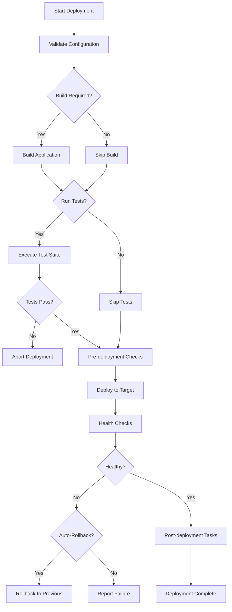

# deploy Command

The `deploy` command deploys your application to a specified environment, handling all necessary build steps and deployment processes.

## Synopsis

```bash
cli-tool deploy [OPTIONS]
```

## Description

Deploys your application to the target environment. This command handles building, testing (optional), and deploying your application to cloud providers or on-premises servers. It manages environment-specific configurations and ensures a smooth deployment process.

## Options

- `-e, --env TEXT`: Target environment (default: `development`)
    - `development`: Development environment
    - `staging`: Staging/testing environment
    - `production`: Production environment
- `-b, --build`: Build the application before deploying (default: enabled)
- `--no-build`: Skip the build step
- `-t, --test`: Run tests before deploying
- `--no-test`: Skip tests (not recommended for production)
- `-c, --config FILE`: Custom configuration file path
- `--dry-run`: Simulate deployment without making actual changes
- `-f, --force`: Force deployment even if checks fail
- `--rollback-on-failure`: Automatically rollback if deployment fails
- `-v, --verbose`: Show detailed deployment logs
- `-q, --quiet`: Suppress non-error output

## Examples

### Basic Deployment

Deploy to the default (development) environment:

```bash
cli-tool deploy
```

Output:
```
Starting deployment...
✓ Validating configuration
✓ Building application
✓ Running pre-deployment checks
✓ Deploying to development
✓ Running post-deployment tasks

Deployment completed successfully!
URL: https://dev.example.com
Version: 1.2.3
Timestamp: 2024-01-21 10:30:45
```

### Deploy to Production

Deploy to production with all safety checks:

```bash
cli-tool deploy --env production --test
```

This will:
1. Build the application
2. Run all tests
3. Validate production configuration
4. Deploy to production environment
5. Verify deployment health

### Deploy with Custom Configuration

Use a specific configuration file:

```bash
cli-tool deploy --env staging --config configs/staging-special.yaml
```

### Dry Run Deployment

Preview what would happen without actually deploying:

```bash
cli-tool deploy --env production --dry-run
```

Output:
```
Dry run - no changes will be made

Deployment plan:
  Environment: production
  Source: local
  Target: AWS ECS (us-east-1)
  Image: myapp:v1.2.3
  
Would perform:
  1. Build Docker image
  2. Push to ECR registry
  3. Update ECS task definition
  4. Deploy new task revision
  5. Wait for health checks
  6. Update load balancer

Estimated time: ~5 minutes
```

### Force Deployment

Override safety checks (use with caution):

```bash
cli-tool deploy --env production --force
```

### Quiet Deployment

Minimal output, useful for CI/CD:

```bash
cli-tool deploy --env production --quiet
```

### Deploy with Auto-Rollback

Enable automatic rollback on failure:

```bash
cli-tool deploy --env production --rollback-on-failure
```

## Deployment Process

### Step-by-Step Flow



### Build Process

When building is enabled, the command:

1. Installs dependencies
2. Compiles/transpiles code if needed
3. Optimizes assets
4. Generates production artifacts
5. Creates deployment package

### Pre-deployment Checks

Before deploying, the system validates:

- Configuration files are valid
- Required environment variables are set
- Target environment is accessible
- No other deployments are in progress
- Current user has necessary permissions

### Post-deployment Tasks

After successful deployment:

- Runs database migrations (if configured)
- Clears caches
- Sends notifications
- Updates deployment logs
- Verifies application health

## Environment Configuration

### Configuration File Structure

Each environment has its own configuration in `config/<env>.yaml`:

```yaml
# config/production.yaml
environment: production

deployment:
  provider: aws
  region: us-east-1
  service: ecs
  cluster: production-cluster
  task_definition: my-app-prod

build:
  enable: true
  optimize: true
  minify: true

health_check:
  enabled: true
  endpoint: /health
  timeout: 300
  interval: 10

notifications:
  slack:
    enabled: true
    webhook_url: ${SLACK_WEBHOOK_URL}
  email:
    enabled: true
    recipients:
      - devops@example.com
```

## Deployment Strategies

### Blue-Green Deployment

Minimize downtime with blue-green strategy:

```bash
cli-tool deploy --env production --strategy blue-green
```

### Rolling Deployment

Gradual rollout across instances:

```bash
cli-tool deploy --env production --strategy rolling --batch-size 2
```

### Canary Deployment

Deploy to a small percentage first:

```bash
cli-tool deploy --env production --strategy canary --canary-percent 10
```

## Exit Codes

- `0`: Success - deployment completed successfully
- `1`: Error - deployment failed
- `2`: Error - build failed
- `3`: Error - tests failed
- `4`: Error - configuration invalid
- `5`: Error - health checks failed
- `6`: Warning - deployment succeeded but with warnings

## Rollback

If deployment fails and auto-rollback is enabled:

```bash
Deployment failed: Health checks timeout
✓ Initiating automatic rollback
✓ Restoring previous version (1.2.2)
✓ Verifying rollback health
✓ Rollback completed successfully

Previous version (1.2.2) is now active.
```

Manual rollback can be done with:

```bash
cli-tool rollback --env production
```

## Notifications

### Slack Integration

Configure Slack notifications in your environment config:

```yaml
notifications:
  slack:
    enabled: true
    webhook_url: https://hooks.slack.com/services/YOUR/WEBHOOK/URL
    channel: "#deployments"
    mention_on_failure: "@devops-team"
```

### Email Notifications

Configure email alerts:

```yaml
notifications:
  email:
    enabled: true
    smtp_server: smtp.gmail.com
    smtp_port: 587
    from: noreply@example.com
    recipients:
      - devops@example.com
      - team-lead@example.com
```

## Monitoring Deployment

### View Deployment Logs

```bash
# Follow deployment logs in real-time
cli-tool deploy --env production --verbose

# Save logs to file
cli-tool deploy --env production --verbose > deployment.log 2>&1
```

### Check Deployment Status

During deployment:

```bash
# In another terminal
cli-tool status --env production --watch
```

## Common Issues

### Configuration Not Found

**Problem**: Error "Configuration file not found for environment: production"

**Solution**: Ensure `config/production.yaml` exists or specify custom config:
```bash
cli-tool deploy --env production --config path/to/config.yaml
```

### Build Failed

**Problem**: Build process fails with errors

**Solution**: 
1. Check build logs: `cli-tool logs --build`
2. Verify dependencies are installed
3. Try building locally first: `cli-tool build`

### Health Checks Timeout

**Problem**: Deployment fails with "Health checks timeout"

**Solution**:
1. Check application logs: `cli-tool logs --env production`
2. Verify the health check endpoint is accessible
3. Increase timeout in configuration
4. Check for application errors

### Permission Denied

**Problem**: Insufficient permissions to deploy

**Solution**:
1. Verify credentials: `cli-tool config check`
2. Ensure proper IAM/access policies
3. Check with your system administrator

## Best Practices

1. **Always test in staging first**
   ```bash
   cli-tool deploy --env staging --test
   ```

2. **Use dry-run for production**
   ```bash
   cli-tool deploy --env production --dry-run
   ```

3. **Enable auto-rollback for critical environments**
   ```bash
   cli-tool deploy --env production --rollback-on-failure
   ```

4. **Review deployment plan before executing**
   ```bash
   cli-tool deploy --env production --dry-run
   # Review output, then deploy
   cli-tool deploy --env production
   ```

5. **Monitor deployments actively**
   ```bash
   # In one terminal
   cli-tool deploy --env production --verbose
   
   # In another terminal
   cli-tool status --env production --watch
   ```

## See Also

- [status command](status.md): Monitor deployment status
- [Getting Started Guide](../getting-started.md): Initial setup
- [FAQ](../faq.md): Common deployment questions
