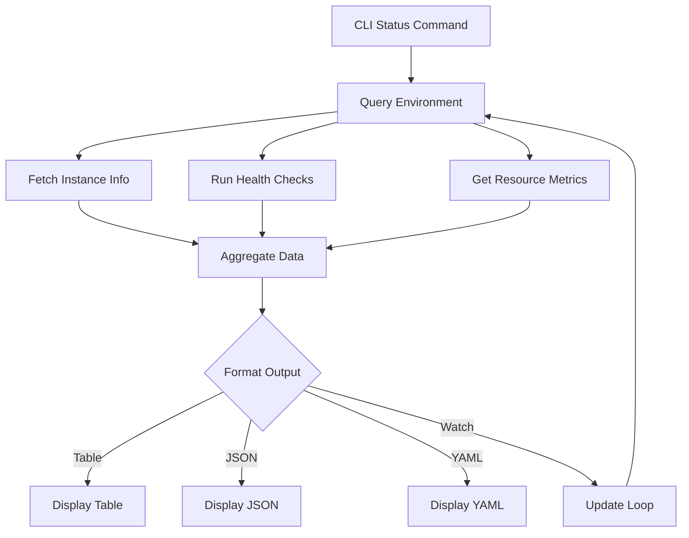

# status Command

The `status` command displays the current status of your application across different environments, including deployment information, health metrics, and resource utilization.

## Synopsis

```bash
cli-tool status [OPTIONS]
```

## Description

Provides comprehensive information about your application's current state, including deployment status, running instances, health checks, and recent activity. This command is essential for monitoring your application and troubleshooting issues.

## Options

- `-e, --env TEXT`: Environment to check (default: current/all)
    - `development`: Development environment
    - `staging`: Staging environment
    - `production`: Production environment
    - `all`: All environments
- `-w, --watch`: Continuously monitor status (updates every 5 seconds)
- `-i, --interval SECONDS`: Update interval for watch mode (default: 5)
- `-d, --detailed`: Show detailed information
- `-j, --json`: Output in JSON format
- `-f, --format TEXT`: Output format (table, json, yaml)
- `--health-only`: Show only health check information
- `--metrics`: Include performance metrics
- `-q, --quiet`: Show only summary information

## Examples

### Basic Status Check

Check the status of the current environment:

```bash
cli-tool status
```

Output:
```
Environment: development
Status: Running
Version: 1.2.3
Deployed: 2024-01-21 10:30:45 (2 hours ago)
Deployed by: john.doe@example.com

Health: Healthy
  ✓ Application: OK (200ms)
  ✓ Database: Connected
  ✓ Cache: Connected
  ✓ Storage: Available

Instances: 2/2 running
  - instance-1: Running (CPU: 12%, Memory: 45%)
  - instance-2: Running (CPU: 15%, Memory: 48%)

Recent Activity:
  2024-01-21 10:30:45 - Deployment completed (v1.2.3)
  2024-01-21 09:15:22 - Configuration updated
  2024-01-21 08:00:00 - Scheduled maintenance completed
```

### Check Production Status

Check production environment:

```bash
cli-tool status --env production
```

### Check All Environments

View status across all environments:

```bash
cli-tool status --env all
```

Output:
```
╔═════════════╦═════════╦═════════╦══════════════════╗
║ Environment ║ Status  ║ Version ║ Health           ║
╠═════════════╬═════════╬═════════╬══════════════════╣
║ development ║ Running ║ 1.2.3   ║ ✓ Healthy        ║
║ staging     ║ Running ║ 1.2.2   ║ ✓ Healthy        ║
║ production  ║ Running ║ 1.2.1   ║ ✓ Healthy        ║
╚═════════════╩═════════╩═════════╩══════════════════╝
```

### Detailed Status

Get detailed information:

```bash
cli-tool status --detailed
```

This includes:
- Complete deployment history
- Detailed health check results
- Resource utilization graphs
- Configuration summary
- Recent logs excerpt

### Watch Mode

Continuously monitor status:

```bash
cli-tool status --watch
```

The display refreshes automatically every 5 seconds:

```
[Auto-refresh every 5s - Press Ctrl+C to stop]

Environment: production
Status: Running ✓
Version: 1.2.1
Uptime: 15d 7h 23m

Health Checks (Last check: 2s ago):
  ✓ Application endpoint    200ms    OK
  ✓ Database connection    15ms     OK
  ✓ Cache connection       8ms      OK
  ✓ External API           250ms    OK

CPU Usage:    [████████░░] 45%
Memory Usage: [███████░░░] 68%
Disk Usage:   [████░░░░░░] 35%

Requests/min: 1,234
Error rate:   0.02%
Avg response: 156ms
```

### Custom Update Interval

Set a custom update interval for watch mode:

```bash
cli-tool status --watch --interval 10
```

### JSON Output

Get status in JSON format for scripting:

```bash
cli-tool status --json
```

Output:
```json
{
  "environment": "production",
  "status": "running",
  "version": "1.2.1",
  "deployed_at": "2024-01-21T10:30:45Z",
  "deployed_by": "john.doe@example.com",
  "health": {
    "status": "healthy",
    "checks": {
      "application": {
        "status": "ok",
        "response_time_ms": 200
      },
      "database": {
        "status": "connected",
        "response_time_ms": 15
      },
      "cache": {
        "status": "connected",
        "response_time_ms": 8
      }
    }
  },
  "instances": {
    "desired": 2,
    "running": 2,
    "details": [
      {
        "id": "instance-1",
        "status": "running",
        "cpu_percent": 12,
        "memory_percent": 45
      },
      {
        "id": "instance-2",
        "status": "running",
        "cpu_percent": 15,
        "memory_percent": 48
      }
    ]
  }
}
```

### Health Check Only

Show only health check information:

```bash
cli-tool status --health-only
```

Output:
```
Health Status: Healthy ✓

Service Health Checks:
  ✓ Application    200ms    OK
  ✓ Database       15ms     Connected
  ✓ Cache          8ms      Connected
  ✓ Storage        45ms     Available
  ✓ External API   250ms    OK

Last check: 5 seconds ago
Next check: in 25 seconds
```

### Performance Metrics

Include detailed performance metrics:

```bash
cli-tool status --metrics
```

Displays additional information:
- CPU and memory trends
- Network I/O
- Disk I/O
- Request rate and latency
- Error rates

## Status Information

### Application Status

The status field can have these values:

- **Running**: Application is running normally
- **Starting**: Application is starting up
- **Stopping**: Application is shutting down
- **Stopped**: Application is not running
- **Degraded**: Application is running but with issues
- **Failed**: Application has failed

### Health Status

Health checks verify:

- **Application endpoint**: HTTP health check on main endpoint
- **Database**: Database connectivity and query response
- **Cache**: Cache service availability (Redis, Memcached, etc.)
- **Storage**: File storage or object storage accessibility
- **External dependencies**: Third-party API availability

Each check returns:
- Status (OK, Warning, Error)
- Response time
- Additional details

### Resource Utilization

Displays:
- **CPU**: Percentage of CPU used across instances
- **Memory**: Percentage of memory used
- **Disk**: Percentage of disk space used
- **Network**: Network I/O rates

## Status Monitoring Diagram



## Exit Codes

- `0`: Success - status retrieved successfully
- `1`: Error - unable to connect to environment
- `2`: Warning - environment running but unhealthy
- `3`: Error - environment is stopped or failed
- `4`: Error - authentication failed

## Interpreting Results

### Healthy Application

```
Status: Running ✓
Health: Healthy ✓
All instances running
No errors or warnings
```

### Degraded Application

```
Status: Degraded ⚠
Health: Partially Healthy
  ✓ Application: OK
  ⚠ Database: Slow response (2000ms)
  ✓ Cache: Connected
  ✗ External API: Timeout

Action required: Check database performance
```

### Failed Application

```
Status: Failed ✗
Health: Unhealthy
  ✗ Application: Connection refused
  ✗ Database: Not connected
  ✗ Cache: Not connected

Action required: Check logs and restart
```

## Alerts and Warnings

The status command shows warnings for:

- High resource utilization (>80%)
- Slow response times (>1000ms)
- Failed health checks
- Instance failures
- Configuration issues
- Recent errors

## Integration with Monitoring

### Export to Monitoring Systems

```bash
# Send status to monitoring system
cli-tool status --json | curl -X POST https://monitoring.example.com/api/status \
  -H "Content-Type: application/json" \
  -d @-
```

### Scheduled Status Checks

Set up a cron job to monitor status:

```bash
# Add to crontab
*/5 * * * * cli-tool status --env production --json >> /var/log/cli-tool/status.log
```

## Common Issues

### Connection Timeout

**Problem**: "Unable to connect to environment"

**Solution**:
1. Check network connectivity
2. Verify credentials: `cli-tool config check`
3. Ensure environment is running
4. Check firewall rules

### Authentication Failed

**Problem**: "Authentication failed for environment: production"

**Solution**:
1. Update credentials: `cli-tool config set`
2. Check API keys or tokens
3. Verify permissions

### Incomplete Status

**Problem**: Some status information is missing

**Solution**:
1. Use `--detailed` flag for more information
2. Check if monitoring is enabled in configuration
3. Verify permissions to access metrics

## Best Practices

1. **Regular monitoring**: Check status regularly
   ```bash
   cli-tool status --env production
   ```

2. **Automated checks**: Set up automated status checks
   ```bash
   # In CI/CD or cron
   cli-tool status --quiet || alert-team
   ```

3. **Watch critical deployments**: Monitor new deployments
   ```bash
   cli-tool status --env production --watch
   ```

4. **Export for analysis**: Save status to logs
   ```bash
   cli-tool status --json >> status-$(date +%Y%m%d).json
   ```

5. **Health checks before operations**: Always check status before deploying
   ```bash
   cli-tool status --health-only && cli-tool deploy
   ```

## See Also

- [deploy command](deploy.md): Deploy your application
- [init command](init.md): Initialize a new project
- [Getting Started Guide](../getting-started.md): Initial setup
- [FAQ](../faq.md): Troubleshooting and common questions
