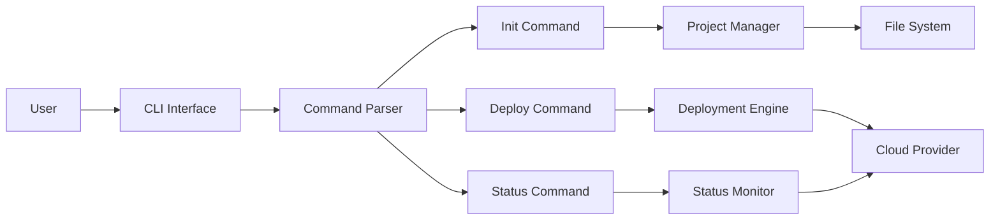

# CLI Tool Documentation

Welcome to the CLI Tool documentation! This comprehensive guide will help you get started with our command-line interface and explore all its powerful features.

## Overview

The CLI Tool is a versatile command-line utility designed to streamline your development workflow. It provides a simple and intuitive interface for common tasks, making it easy to:

- Initialize new projects
- Deploy applications to various environments
- Check status and monitor deployments
- Manage configurations efficiently

## Key Features

- **Simple Commands**: Easy-to-remember commands that follow intuitive patterns
- **Cross-Platform**: Works on Windows, macOS, and Linux
- **Extensible**: Plugin architecture allows you to extend functionality
- **Well-Documented**: Comprehensive documentation with examples
- **Active Community**: Regular updates and community support

## Quick Start

Get started in minutes:

```bash
# Install the CLI tool
pip install cli-tool

# Initialize a new project
cli-tool init my-project

# Deploy to production
cli-tool deploy --env production
```

## Architecture Overview

The CLI tool follows a modular architecture that makes it easy to extend and maintain:



## Need Help?

- Check out our [Getting Started Guide](getting-started.md)
- Browse the [Command Reference](commands/init.md)
- Read the [FAQ](faq.md)
- Join our community on GitHub

## Contributing

We welcome contributions! Please see our contributing guidelines to learn how you can help improve the CLI tool.

## License

This project is licensed under the MIT License - see the LICENSE file for details.
